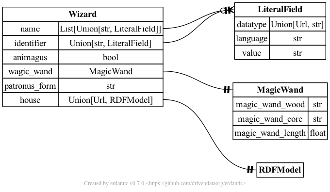

## Defining a model of your own and extending models

### Extending a model

Extending a model can be done by inheriting from an existing model and adding and/or re-defining fields.
Inheritance works the same way as for normal classes.

`model_config` can be skipped in child class definition to use parent class configuration or you can provide a custom one 
to override.

Let's consider example of extending `Agent` model with a mandatory birthday field (with DateTimeDescription object as 
expected value type) and an optional gender field with values corresponding [Athena](https://athena.ohdsi.org/search-terms/start) classes.
In the same time we do not want to allow multiple names so would like to override that field changing its type:

```python
from pydantic import Field
from rdflib import FOAF, TIME, URIRef
from sempyro.foaf import Agent
from sempyro.time import DateTimeDescription
from typing import Literal

class CustomAgent(Agent):
    name: str = Field(
        description="A name of the agent",
        json_schema_extra={
            "rdf_term": FOAF.name,
            "rdf_type": "rdfs_literal"
        }
    )
    
    birthday: DateTimeDescription = Field(
        description="The birthday of this Agent",
        json_schema_extra={
            "rdf_term": FOAF.birthday,
            "rdf_type": "uri"
        }
    )
    
    gender: Literal["Male", "Female", "Other", "Ambiguous", "Unknown"] = Field(
        default=None,
        description="Gender as per Athena classification",
        json_schema_extra={
            "rdf_term": FOAF.gender,
            "rdf_type": "xsd:string"
        }
    )

wizard = CustomAgent(name="Harry Potter",
                     identifier="https://harrypotter.fandom.com/wiki/Harry_Potter",
                     birthday = DateTimeDescription(day="---30", month="--07", year="1980", unitType=TIME.day),
                     gender="Male"
                     )

print(wizard.to_graph(URIRef("https://harrypotter.fandom.com/wiki/Harry_Potter")).serialize())
```
For each field we provide desired `rdf_term` and `rdf_type` to manage conversion to RDF graph. Note, in case of overriding 
a field all the field information needs to be provided, it is overrides completely from the new definition and no merge or fulfilling of 
missing attributed is not possible.

The example code above prints out the following:
```text
@prefix dcterms: <http://purl.org/dc/terms/> .
@prefix foaf: <http://xmlns.com/foaf/0.1/> .
@prefix time: <http://www.w3.org/2006/time#> .
@prefix xsd: <http://www.w3.org/2001/XMLSchema#> .
<https://harrypotter.fandom.com/wiki/Harry_Potter> a foaf:Agent ;
    dcterms:identifier "https://harrypotter.fandom.com/wiki/Harry_Potter" ;
    foaf:birthday [ a time:DateTimeDescription ;
            time:day "---30"^^xsd:gDay ;
            time:hasTRS <http://www.opengis.net/def/uom/ISO-8601/0/Gregorian> ;
            time:month "--07"^^xsd:gMonth ;
            time:unitType time:day ;
            time:year "1980"^^xsd:gYear ] ;
    foaf:gender "Male"^^xsd:string ;
    foaf:name "Harry Potter" .
```

### Defining your own model

To define a model of your own you need to deside what kinds of objects you need, how they relate to each other, what 
type are their properties and what namespaces they belong. Then you implement those relationships with the package.

Let's create a small example to describe wizards of Harry Potter world.
Let's imagine there is a namespace to describe Harry Potter books ontology. We will inplement it like this:
```python
from rdflib.namespace import DefinedNamespace, Namespace
from rdflib import URIRef

class HPS(DefinedNamespace):
    _NS = Namespace("http://example.com/harry-potter-saga#")
    # properties
    magic_wand: URIRef
    animagus: URIRef
    magic_wand_core: URIRef
    magic_wand_wood: URIRef
    magic_wand_length: URIRef
    patronus_form: URIRef
    hogwarts_house: URIRef

    # Classes
    Wizard: URIRef
    MagicWand: URIRef
    House: URIRef
```
Now let's define a class Wizard based on foaf.Agent but extending it with some specific properties. One of them will be 
a `magic_wand` which is an object itself, so we need to define it first:
```python
from sempyro import RDFModel
import logging
from pydantic import Field, field_validator, ValidationError, ConfigDict

log = logging.getLogger(__name__)

class MagicWand(RDFModel):
    model_config = ConfigDict(
                              json_schema_extra={
                                  "$ontology": "https://harrypotter.fandom.com/wiki/Main_Page",
                                  "$namespace": "http://example.com/harry-potter-saga#",
                                  "$IRI": HPS.MagicWand,
                                  "$prefix": "hps"
                              }
                              )
    
    magic_wand_wood: str = Field(
        description="Wood a magic wand is made of",
        json_schema_extra={
            "rdf_term": HPS.magic_wand_wood,
            "rdf_type": "xsd:string" 
        }
    )
    magic_wand_core: str = Field(
        description="Core material of a magic wand", 
        json_schema_extra={
            "rdf_term": HPS.magic_wand_core,
            "rdf_type": "xsd:string"
        }
    )
    magic_wand_length: float = Field(
        description="Magic wand length in inches", 
        json_schema_extra={
            "rdf_term": HPS.magic_wand_length, 
            "rdf_type": "xsd:decimal"
        }
    )
    # it is considered wands are rarely longer than 14 inches, it's add a validation and warning
    @field_validator("magic_wand_length", mode="before")
    @classmethod
    def length_validator(cls, value: float) -> float:
        if value < 0:
            raise ValidationError("Length can not be negative")
        elif value > 14:
            log.warning("Length exceeds 14'' please check")
        return value
```
Now Let us define a Wizard:
```python
from pydantic import Field, ConfigDict, AnyUrl
from sempyro.foaf import Agent
from typing import Union
from sempyro import RDFModel

class Wizard(Agent):
    model_config = ConfigDict(
                              json_schema_extra={
                                  "$ontology": "https://harrypotter.fandom.com/wiki/Main_Page",
                                  "$namespace": "http://example.com/harry-potter-saga#",
                                  "$IRI": HPS.Wizard,
                                  "$prefix": "hps"
                              }
                              )
    animagus: bool = Field(
        default=False,
        description="Ability to turn to an animal",
        json_schema_extra={
            "rdf_term": HPS.animagus,
            "rdf_type": "xsd:boolean"
        }
    )
    wagic_wand: MagicWand = Field(
        description="Ability to turn to an animal",
        json_schema_extra={
            "rdf_term": HPS.magic_wand,
            "rdf_type": "uri"
        }
    )
    patronus_form: str = Field(
        default=None,
        description="Form of patronus",
        json_schema_extra={
            "rdf_term": HPS.patronus_form,
            "rdf_type": "xsd:string"
        }
    )
    # For house we put a union of url type and RDFModel: it can be an external url as well as you can define a class 
    # House and then put its subject as an internal reference or put a whole object as a node. This notation can be used
    # when you are not sure or not care about the exact structure of the object
    house: Union[AnyUrl, RDFModel] = Field(
        description="Hogwarts house", 
        json_schema_extra={
            "rdf_term": HPS.hogwarts_house,
            "rdf_type": "uri"
        }
    )
```
Now let's create a Wizard class instance with Hermione Granger data:
```python
from rdflib import URIRef

hermione_wand = MagicWand(magic_wand_wood="vine", 
                          magic_wand_core="dragon hartstring",
                          magic_wand_length=10.75)

hermione = Wizard(name=["Hermione Granger"],
                  identifier="https://harrypotter.fandom.com/wiki/Hermione_Granger",
                  animagus=False,
                  wagic_wand=hermione_wand,
                  patronus_form="otter",
                  house="https://harrypotter.fandom.com/wiki/Gryffindor"
)

print(hermione.to_graph(URIRef("https://harrypotter.fandom.com/wiki/Hermione_Granger")).serialize())
```
```text
@prefix dcterms: <http://purl.org/dc/terms/> .
@prefix foaf: <http://xmlns.com/foaf/0.1/> .
@prefix hps: <http://example.com/harry-potter-saga#> .
@prefix xsd: <http://www.w3.org/2001/XMLSchema#> .
<https://harrypotter.fandom.com/wiki/Hermione_Granger> a hps:Wizard ;
    hps:hogwarts_house <https://harrypotter.fandom.com/wiki/Gryffindor> ;
    hps:magic_wand [ a hps:MagicWand ;
            hps:magic_wand_core "dragon hartstring"^^xsd:string ;
            hps:magic_wand_length 10.75 ;
            hps:magic_wand_wood "vine"^^xsd:string ] ;
    hps:patronus_form "otter"^^xsd:string ;
    dcterms:identifier "https://harrypotter.fandom.com/wiki/Hermione_Granger" ;
    foaf:name "Hermione Granger" .

```
### Visualization with erdantic

You may need to visualize your model. This can be done with `erdantic` package:
```python
import erdantic as erd
# # Easy one-liner
erd.draw(Wizard, out="wizard.png")

# Or create a diagram object that you can inspect and do stuff with
diagram = erd.create(Wizard)
diagram.models
diagram.draw("wizard.png")
```
with the following output:


Note: you may face issues with `pygraphviz` dependency when installing `erdantic`. Below there is a solution 
for MacOs Sonoma:
```commandline
brew install graphviz
pip install --no-cache-dir \
  --config-settings="--global-option=build_ext" \
  --config-settings="--global-option=-I$(brew --prefix graphviz)/include/" \
  --config-settings="--global-option=-L$(brew --prefix graphviz)/lib/" \
  pygraphviz
```
