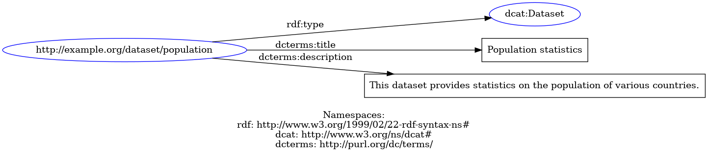
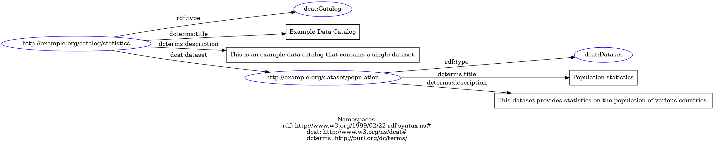

# Intro

## Introduction to RDF, DCAT and DCAT-AP

### RDF

The **Resource Description Framework (RDF)** is a standard model for data interchange on the web,
developed by the World Wide Web Consortium (W3C). It's a type of semantic modelling that represents
data as a graph of interconnected nodes and edges, where each node is a resource (like a web page, a
person, or a concept), and each edge represents a relationship between two resources. RDF data is
often expressed using *triples*, which consist of a *subject*, a *predicate*, and an *object*.
For example, in the triple "Paris has_population 2.2_million", "*Paris*" is the subject,
"*has_population*" is the predicate, and "*2.2_million*" is the object.

### DCAT

The **Data Catalogue Vocabulary (DCAT)** is an RDF vocabulary designed to facilitate
interoperability between data catalogs published on the web. It's essentially a set of terms that
can be used to describe datasets and catalogs in a standardized way, making it easier for machines
to understand and process this information. For instance, using DCAT, you can describe a dataset's
title, publisher, when it was last updated, its license, and so on. This makes it easier for data
consumers to discover and understand the datasets that are available, and it also helps data
providers to publish their data in a way that's more interoperable.

### DCAT-AP

The **DCAT Application Profile for data portals in Europe (DCAT-AP)** is an application profile of
DCAT, which means it's a specific set of guidelines and constraints for using DCAT in a particular
context. In this case, DCAT-AP provides a set of rules for describing datasets and data services in
European public sector data portals. It's designed to make it easier for data from different portals
to be integrated and reused across different countries and sectors.

DCAT-AP extends DCAT with a number of additional terms and rules. For example, it includes terms for
describing the spatial and temporal coverage of a dataset, the language of the data, and the access
rights associated with it.

## Examples

### Minimal dataset

Here we consider a dataset about population statistics. To identify the dataset, we first need an
 **IRI**, or an *Internationalized Resource Identifier*. This is like a *URI*, but allows Unicode characters.
 The IRI does not have to be a real, publicly resolvable URL although this is advisable. For this
 example, we will pick `http://example.org/dataset/population`. We want to describe using DCAT-AP
 that it is a Dataset, and describe it's *title* and *description*.

 Below, we show how to do this using RDF triples. Every line has one set of triples, consisting of a
 *subject*, a *predicate* and an *object*, as mentioned above.

```nt
<http://example.org/dataset/population> <http://www.w3.org/1999/02/22-rdf-syntax-ns#type> <http://www.w3.org/ns/dcat#Dataset> .
<http://example.org/dataset/population> <http://purl.org/dc/terms/title> "Population statistics" .
<http://example.org/dataset/population> <http://purl.org/dc/terms/description> "This dataset provides statistics on the population of various countries." .
```

The first line explains we are describing a DCAT Dataset. The second provides the title, the third
the description. Note that the subject is the same: we are describing the same thing, just different
properties.

This can also be plotted as a graph, which would then look like this:


As you can see, the first written example contains a lot of duplicates. In practice, the *Turtle*
format is often used to *serialize* the graph (put it into text):

```turtle
@prefix rdf: <http://www.w3.org/1999/02/22-rdf-syntax-ns#> .
@prefix dcat: <http://www.w3.org/ns/dcat#> .
@prefix dcterms: <http://purl.org/dc/terms/> .

<http://example.org/dataset/population> a dcat:Dataset ;
  dcterms:title "Population statistics" ;
  dcterms:description "This dataset provides statistics on the population of various countries."
  .
```

The *Turtle* representation as well as the first explicit *Triple* representation are functionally
equivalent and can be losslessly converted between each other. They contain the exact same graph,
the one from above Figure.

## Dataset in a Catalogue

DCAT can also describe Catalogues. A catalogue is defined as *a curated collection of metadata about
resources*. In practice, this usually means a collection of Datasets, As an IRI, we pick
`http://example.org/catalog/statistics`, which contains the Dataset we just defined. As a graph,
this now looks as follows:



As a *Turtle*, it can be serialized as follows:

```turtle
@prefix rdf: <http://www.w3.org/1999/02/22-rdf-syntax-ns#> .
@prefix dcat: <http://www.w3.org/ns/dcat#> .
@prefix dcterms: <http://purl.org/dc/terms/> .

<http://example.org/catalog/statistics> a dcat:Catalog ;
  dcterms:title "Example Data Catalog" ;
  dcterms:description "This is an example data catalog that contains a single dataset." ;
  dcat:dataset <http://example.org/dataset/population> .

<http://example.org/dataset/population> a dcat:Dataset ;
  dcterms:title "Population statistics" ;
  dcterms:description "This dataset provides statistics on the population of various countries."
  .
```

Notice how the description of the Dataset itself remains unchanged and how the Catalog uses the
*IRI* to refer to the Dataset.

These simple examples can be extended pretty much indefinitely. There are a lot of properties for
Dataset beyond title and description. For example, Distributions can be added to a Dataset, which
describe where a user can obtain the actual data of the dataset. There are also properties like
the publisher of the dataset, the contact point and a whole lot more. The text fields can also
be described multiple times for different languages.

## Using SeMPyRO

### A simple Dataset

*SeMPyRO* makes it easy to model DCAT in a Pythonic way. We could model above Dataset in the
following way.

```python
from sempyro import LiteralField
from sempyro.dcat import DCATDataset
from rdflib import URIRef

dataset_title = LiteralField(value="Population statistics")
description = LiteralField(value="This is description of Test dataset")

dataset = DCATDataset(title=[dataset_title],
                      description=[description],
                      )
dataset_graph = dataset.to_graph(URIRef("http://example.com/dataset/population"))
print(dataset_graph.serialize())
```

Note how the title and description are *Lists*, to allow for additional languages to be added.
Also note how it is mandatory to add an IRI when serializing the model to a Graph.

This code using SeMPyRO will result in the exact same output as before:

```turtle
@prefix rdf: <http://www.w3.org/1999/02/22-rdf-syntax-ns#> .
@prefix dcat: <http://www.w3.org/ns/dcat#> .
@prefix dcterms: <http://purl.org/dc/terms/> .

<http://example.org/dataset/population> a dcat:Dataset ;
  dcterms:title "Population statistics" ;
  dcterms:description "This dataset provides statistics on the population of various countries."
  .
```

The default serialization from RDFLib is *Turtle*. It is also possible to serialize to other
representations:

```python
print(dataset_graph.serialize(format="ntriples"))
```

```
<http://example.com/dataset/population> <http://www.w3.org/1999/02/22-rdf-syntax-ns#type> <http://www.w3.org/ns/dcat#Dataset> .
<http://example.com/dataset/population> <http://purl.org/dc/terms/title> "Population statistics" .
<http://example.com/dataset/population> <http://purl.org/dc/terms/description> "This is description of Test dataset" .
```

### Extending with a Catalog

Adding a Catalog could be done as follows:

```python
from sempyro import LiteralField
from sempyro.dcat import DCATDataset, DCATCatalog
from rdflib import URIRef

catalog_title = LiteralField(value="Example Data Catalog")
catalog_desc = LiteralField(value="This is an example data catalog that contains a single dataset.")

dataset_subject = URIRef("http://example.com/dataset/population")

catalog = DCATCatalog(title=[catalog_title], description=[catalog_desc], dataset=[dataset_subject])

dataset_title = LiteralField(value="Population statistics")
description = LiteralField(value="This is description of Test dataset")

dataset = DCATDataset(title=[dataset_title],
                      description=[description],
                      )

combined_graph = catalog.to_graph(URIRef("http://example.com/catalog/example")) + dataset.to_graph(dataset_subject)

print(combined_graph.serialize())
```

This will result in the following output:

```turtle
@prefix rdf: <http://www.w3.org/1999/02/22-rdf-syntax-ns#> .
@prefix dcat: <http://www.w3.org/ns/dcat#> .
@prefix dcterms: <http://purl.org/dc/terms/> .

<http://example.org/catalog/statistics> a dcat:Catalog ;
  dcterms:title "Example Data Catalog" ;
  dcterms:description "This is an example data catalog that contains a single dataset." ;
  dcat:dataset <http://example.org/dataset/population> .

<http://example.org/dataset/population> a dcat:Dataset ;
  dcterms:title "Population statistics" ;
  dcterms:description "This dataset provides statistics on the population of various countries."
  .
```

Note how we add up the Graphs of the Catalog and the Dataset, the dataset subject IRI will be used as an internal 
reference to connect catalog and dataset.


This package, SeMPyRO, supports a lot of advanced modelling. For more details, see [here](Models.md).
